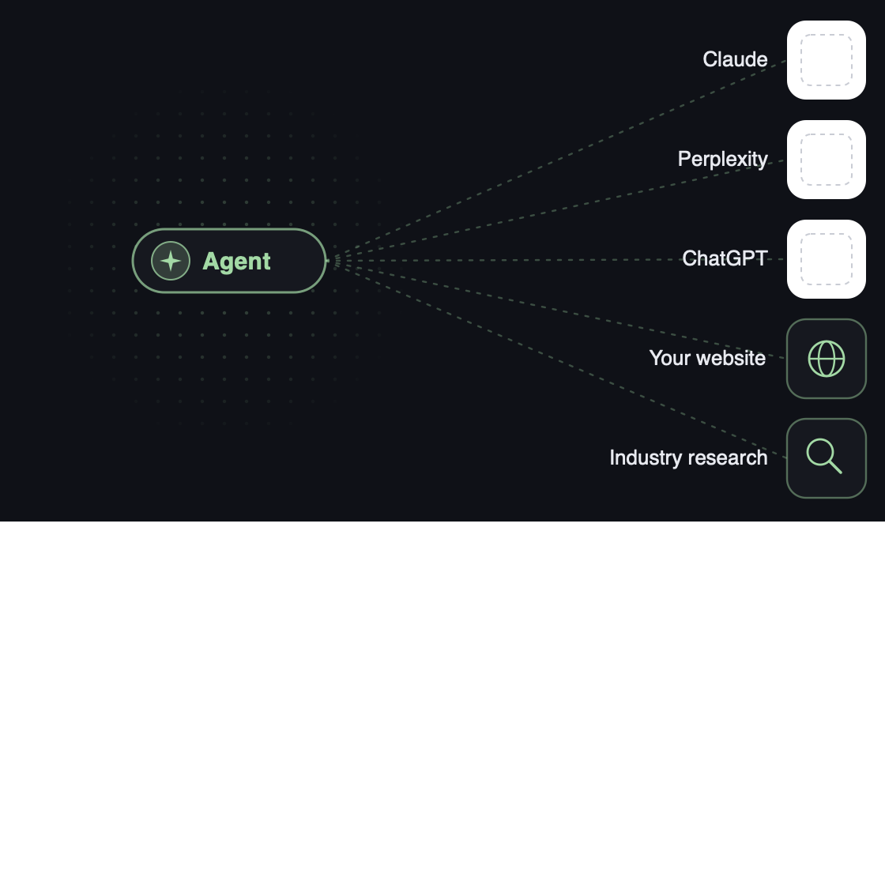

# AI Visibility Audit

> Lobo Growth's method of measuring and improving how AI represents its clients.

By Patrick Kemp / [Lobo Growth](https://lobogrowth.com). This is the public mirror of the system — no client data. The worked example (`companies/northwind/`) is a fully synthetic company.

## Abstract

An agentic system that:

- (a) measures how LLM models represent a company in prompts used by its buyers.
- (b) audits that company's online presence on dimensions that influence LLM responses.
- (c) makes strategic recommendations after analyzing LLM responses and audit results.

The system runs in three phases designed around human approval checkpoints.

1. **Research:** core context, prompt, and scoring artifacts are created.
2. **Analysis:** human-approved prompts and the company's online presence are analyzed.
3. **Reporting:** human-approved recommendations and findings are compiled into a report.

The system runs as three Claude Code-harnessed agents that execute pre-determined sequences of sub-agents, deterministic scripts, and human operator-facing approval requests.

## Design Principles

The system has core design principles that differentiate it from existing industry tools:

- **Discovery (category, unbranded) and Assessment (branded) prompts separated.**
  - Most tools group them, but they have different improvement levers and buyer stages.
- **A performance score is used to measure how a LLM response meets success criteria.**
  - Most tools focus on mention rate, which doesn't measure the quality of a response.
- **Audit results are quantitative. A company is scored 0-5 on 28+ dimensions using rubrics.**
  - Most audits are qualitative assessments that require judgment to interpret.
- **All scores produced by the system are reproducible.**
  - Most systems that rely on AI judgement drift from run-to-run with the same inputs.
- **Improvement is core. A purpose-built reasoning agent recommends high-leverage fixes.**
  - Most systems stop with the results for humans or separate AI systems to pick up.

## Research Phase

### Phase Summary

Takes the human-provided `"<Company> <domain>"` and produces context artifacts and proposed prompts and scoring rubrics for review by a human operator.

### Step 0 — Ground

Reads `.claude/context/aeo-audit-framework.md` (the methodology) before anything else, so the orchestrator and both subagents reason from the same definitions.

### Step 1 — Parse input

Extracts company name + domain from `$ARGUMENTS`, derives a kebab-case slug. The slug is the primary key for the entire pipeline.

### Step 2 — Gather context (`audit-context-gatherer` subagent)

Tools needed: `Read, Write, WebSearch, WebFetch`.

- Uses web search and web fetch (~10 searches) to determine the following:
  - What the company does (in the company's own words)
  - The company's ICP
  - Relevant category terms (which seed the discoverability prompts)
  - Positioning vocabulary (which grounds the prompt grader)
  - Competitors (which define the share-of-voice set)
  - The company's founders, key people, trust signals, and pricing
  - It is required to append a source URL to each material claim to prevent hallucinations.

**Writes:**
- `context.md` — human-readable file off a template. This grounds downstream agents.
- `context.json` — machine-readable file for the deterministic scripts.

### Step 3 — Define prompts (`audit-prompt-definer` subagent)

Reads `context.md`. Tools: `Read, Write`

- Produces 6 prompts (configurable), 3 per Discoverability and Assessment tracks:
  - Avoids overly-structured prompts, jargon, marketing phrases and URLs.
  - For Discoverability, prompts are drafted in one of three areas, always drafting at least one prompt in each: (1) direct "best `<category>` for `<ICP>`" (2) use-case/job framing (3) and competitor alternatives naming the *incumbent rival*.
  - For Assessment, prompts are drafted in one of three areas, always drafting at least one prompt in each: (1) open-ended "tell me about the company `<brand>`", (2) fit-for-ICP, (3) **head-to-head** "`<brand>` vs `<rival>`".
  - Comparison prompts of both types are appended with a tag so they can be analyzed separately later: `is_comparison:true, named_rival:<rival>`.
- For each prompt, it appends success criteria to score prompt responses:
  - Each prompt gets 2–4 criteria, each atomic and independently checkable.
  - This is important for the performance score's later pass/partial/fail check on each.
  - Assessment **c1 is always the right-entity check**. Head-to-head gets a "presents brand as better-or-equal with real differentiators" criterion that the win/tie/loss verdict keys on. Weights default to 1.

**Writes:**
- `prompts.json` (array `disc-1..3`, `assess-1..3`, criterion ids `<prompt-id>.cN`)

### Step 4 — Write to Notion (Human Approval Gate 1)

Orchestrator writes to three databases for review by operator, prints a summary and stops:

- **Audit Index:** one row per company w/ run slug; Status set to `Awaiting prompt approval`.
- **Audit Prompts:** one row per prompt, mapped to discoverability or assessment.
- **Audit Criteria:** one row per criterion so the operator can edit the atomic list.

## Analysis Phase

### Phase Summary

Reads the human-approved prompts and scoring rubric from Notion. It submits prompts to LLM models (with web search enabled) using OpenRouter's API. It gathers deterministic evidence about the company's site and reputation.

Importantly, no score is ever an LLM's free-form opinion. The response scoring agent produces a pass / partial / fail verdict tied to a verbatim quote pulled from the answer, and a separate deterministic script validates that quote and does the arithmetic.

It summarizes scorecards, recommendations and a fix list for human review.

### Step 0 — Ground + preconditions

Reads the methodology file, confirms the OpenRouter API key is set (stops if not), and takes the `<slug>` as its key. Every script and subagent in this phase keys off that slug.

### Step 1 — Sync approved prompts + criteria

**Reads:** Notion (Audit Prompts, Audit Criteria)

Rebuilds `prompts.json` from the Notion tables, so any edits the operator made at Gate 1 are used. Pulls prompt text, track, runs, and the comparison tags from Audit Prompts, and one row per criterion (text / weight / kill) from Audit Criteria, grouped back onto each prompt.

**Writes:** `prompts.json` (rebuilt from Notion inputs)

### Step 2 — Run the surfaces under test (`run-prompts.mjs`)

**Reads:** `prompts.json`

- Fires every prompt at three live surfaces using OpenRouter's API, **web search ON** (a grounded answer is the entire point):
  - **Claude** — Sonnet 4.6
  - **Perplexity** — sonar-pro
  - **ChatGPT** — gpt-5-mini
- Each prompt runs *k* times per its approved run-count because results are non-deterministic.
- Failed calls retry once, then land as error rows that are **excluded from every denominator** so a transient failure never distorts a rate. The only metered cost in the whole pipeline lives here.

**Writes:** `raw_responses.jsonl`

### Step 3 — Deterministic facts + evidence gathering

Runs the reproducible, key-free fact scripts then evidence agents. **Nothing here assigns a score — these steps only establish facts**, frozen so the scorer (Step 5) reads a fixed ledger.

- `access-checks.mjs`: per-bot-class crawler rules (training vs. search-index vs. user-fetch), live user-agent probes for edge/CDN blocks, and search-index presence (Bing + Brave).
  - **Writes:** `access.json`
- `site-checks.mjs`: a frozen page sample plus scripted structure facts (fetchability without JavaScript, crawl coverage, entity schema, content freshness, FAQ/pricing presence).
  - **Writes:** `site-facts.json`
- **Evidence subagents** inventory needed on-site assets (`onsite-facts.json`) and the off-site reputation graph — what *others* publish about the brand across review sites, press, directories, communities (`offsite-facts.json`).
  - **Writes:** `onsite-facts.json`, `offsite-facts.json`

### Step 4 — Classify (`classify.mjs`)

Applies deterministic rules to append a classification schema regarding named entities in each LLM response. It also analyzes whether the competitive set should be re-written based on responses.

- **Deterministic (key-free):** per answer — was the brand named, was its own domain cited, which pre-listed competitors appeared, and a source-type tag per citation (own domain / competitor / review site / listicle / news / reference / etc.).
  - **Writes:** `classified.jsonl`
- **LLM-backed:** for each discoverability answer, extracts the consideration set the answer *actually builds* (every option it offers the buyer), then runs each extracted name through a **same-category gate** so share-of-voice reflects who genuinely won the category answer — not just the rivals guessed at prep time. Degrades gracefully to the pre-listed competitors on any failure.
  - **Writes:** `consideration.json`

### Step 5 — Score and aggregate LLM Responses

The core step for determining AI visibility results, designed so the performance scoring agent doesn't free-form scores that can't be reproduced and drift from run-to-run.

- **Judge** (`audit-performance-grader`, `Read, Write`). Judges each answer against that prompt's approved criteria, emitting **one pass / partial / fail verdict per criterion, each backed by a verbatim quote** and a confidence flag — plus entity/hallucination/gap flags and, on comparison prompts, a separate win / tie / loss verdict. It judges; **it never scores.**
  - **Writes:** `verdicts.jsonl`
- **Score** (`grade-compute.mjs`). Validates every quote against the actual response text (an unmatched quote is auto-flagged), applies the **floor gate** (a row earns a quality score only if the brand was named, the right entity, and no kill criterion failed — otherwise it scores 0), and computes the score in code as a weighted pass-fraction. Any unsure verdict routes to the Gate 2 review queue.
  - **Writes:** `graded.jsonl` + `review-queue.json`
- **Metrics** (`compute-metrics.mjs`). The single source for every number: mention and citation rates, share-of-voice, per-prompt results as counts (k of n), and **two performance numbers per track — blended, and portrayal-when-named** ("missing from 9 of 15 answers, but described well when present").
  - **Writes:** `metrics.json`

### Step 6 — Conduct and analyze company audit

The core step for auditing a company's own website and off-site presence to determine its strengths, weaknesses, and the high-leverage fixes to pursue first. Split so deterministic, reproducible scoring stays separate from the reasoning about what to fix: code scores and ranks using the rubric, then a high-reasoning agent decides the fixes.

- **Score** (`score-elements.mjs`). Scores every element of the four-lever rubric (access, identity, content, reputation) against fixed anchors — mechanical checks computed in code from the scripted facts, and judged elements scored by a pinned judge with evidence quotes validated against the frozen facts ledgers. It scores; it doesn't decide what matters.
  - **Writes:** `levers.json` (element scores + lever and job rollups)
- **Weight** (`score-importance.mjs`). Determines how much each element matters by blending a **research prior** (the element's evidence tier, fixed across clients) with this run's **observed signal** (how often that element's citation class actually showed up in the answers), then ranks every gap by importance × (5 − score). Reproducible, no LLM calls.
  - **Writes:** `importance.json` (the importance matrix) + merged back into `levers.json`
- **Brief** (`audit-fix-brief`, `Read, Write`, high-reasoning model). Writes a run-aware strategy brief that fuses the brand's positioning with this audit's findings — which job is broken, where the leverage is, which competitors own the category — so the strategist reasons from the real situation, not a generic company description.
  - **Writes:** `fix-context.md`
- **Strategize** (`audit-fix-strategist`, `Read, Write`, high-reasoning model). The reasoning step that **determines the fixes**. Reasons over the brief + scores + importance matrix + evidence ledgers to produce a bespoke, re-ranked fix set — treating the importance ranking as a prior it can **override with stated reasons**, naming concrete targets (the exact roundups, outlets, partners, pages), and sequencing the work. It decides; it never free-forms a score.
  - **Writes:** `fixes.json`
- **Stage** (`audit-insights-stager`, `Read, Write`). Assembles the Gate 2 artifact: the verdict (which job is broken), both scorecards, and the prioritized fix list + deck-ready one-liners **phrased from** the strategist's fixes. It phrases and fits to the presentation's constraints; it does not determine or re-rank the fixes.
  - **Writes:** `findings.json` + `deck-overrides.json`

### Step 7 — Write to Notion (Human Approval Gate 2)

Orchestrator writes to two databases and creates one artifact for human review and stops:

- **Prompt Scores DB:** one row per prompt × surface × run with all scores and metadata.
- **Audit Scores DB:** one row per audit element with score, importance, and strategist notes.

## Reporting Phase

### Phase Summary

Turns the human-approved findings into a client-facing Canva deck. The fill is a clean find-and-replace: a hand-built master holds unique `[[token]]` placeholders, a script produces one value per token from the approved data, and each token is swapped for its value on a clone.

### Step 0 — Ground + preconditions

Reads the methodology file and takes `<slug>` as its key. Stops unless all findings are checked as approved in Notion.

### Step 1 — Build the fill data (`build-deck.mjs`)

**Reads:** `deck-overrides.json`, `findings.json`, `metrics.json`, `levers.json`, `context.json`

Resolves one value per `[[token]]` for the whole deck — scoreboard rates and lever scores, the share-of-voice and cited-domain rows, the best/worst dimension tables, and the top-three fixes. **Aborts on any unresolved token** (a deck never ships with a hole); warns on any line over its slide-frame character cap. Then `prose-lint.mjs` gates the copy.

**Writes:** `canva-fill.json`

### Step 2 — Clone the master

**Reads:** the Canva master ("AI Visibility Report")

Copies pages 1–14 of the master into a fresh per-prospect design (`copy-design`).

**Produces:** the prospect's deck clone (`design_id`)

### Step 3 — Open the clone

`start-editing-transaction` returns the clone's element map (element id + current text per page). The transaction id and pages carry into the fill.

### Step 4 — Fill every token

**Reads:** `canva-fill.json`

In one bulk `perform-editing-operations`, swaps each `[[token]]` for its value by find-and-replace on the matching element. Empty values are left unreplaced so padding rows stay blank; repeated tokens like `[[company]]` are replaced in every element that holds them.

### Step 5 — Review, then commit

Renders the data-heavy slides (scoreboard, share-of-voice) via `get-design-thumbnail` for a numbers-and-highlight sanity check, then `commit-editing-transaction` — edits stay draft and are lost until committed.

**Produces:** the compiled deck (edit URL + view URL + `design_id`)

---

## Scripts

Deterministic, key-free Node (native `fetch`, no dependencies). Phase order, top to bottom.

| Script | Does | Writes |
|--------|------|--------|
| `run-prompts.mjs` | Fires each prompt at Claude / Perplexity / ChatGPT via OpenRouter, web search on, *k* runs each | `raw_responses.jsonl` |
| `access-checks.mjs` | Crawler rules per AI-bot class, live UA probes, Bing + Brave index presence | `access.json` |
| `site-checks.mjs` | Frozen page sample + scripted on-site facts (JS-free fetchability, schema, freshness, FAQ/pricing) | `site-facts.json` |
| `classify.mjs` | Tags each answer (brand named, own domain cited, competitors, citation source-type) + extracts the answer-derived consideration set | `classified.jsonl`, `consideration.json` |
| `grade-compute.mjs` | Validates each grader quote, applies the floor gate, computes Performance Scores in code | `graded.jsonl`, `review-queue.json` |
| `compute-metrics.mjs` | Mention/citation rates, share-of-voice, per-prompt *k/n*, blended + portrayal-when-named | `metrics.json` |
| `score-elements.mjs` | Scores the ~28 four-lever rubric elements against fixed anchors | `levers.json` |
| `score-importance.mjs` | Blends research prior × observed signal, ranks gaps by importance × (5 − score) | `importance.json` (merged into `levers.json`) |
| `score-levers.mjs` | Back-compat shim: runs `score-elements` then `score-importance` | — |
| `build-findings.mjs` | Stitches the run's artifacts into one human-readable Gate 2 doc | `findings.md` |
| `build-audit-log.mjs` | Per-element rows (score + importance + fix) for the Notion Audit Log | `audit-log.json` |
| `build-deck.mjs` | Resolves one value per `[[token]]` for the Canva deck; aborts on any unresolved token | `canva-fill.json` |
| `prose-lint.mjs` | Flags AI-writing tells in deck/report copy; hard-fails on em dashes | — |

`lib/`: `surfaces.mjs` + `openrouter.mjs` (surface adapter + pinned judge calls), `rubric.mjs` (elements, anchors, profiles, importance weights), `importance.mjs` (importance scoring), `dataforseo.mjs` (optional SERP/mentions data, degrades to agent search), `html.mjs`.

## Agents

LLM judgment, grounded by the shared methodology file. `.claude/agents/`.

| Agent | Does | Writes |
|-------|------|--------|
| `audit-context-gatherer` | Researches the company from public sources, pins the entity + archetype profile | `context.md`, `context.json` |
| `audit-prompt-definer` | Drafts the 6 prompts + per-criterion success rubric | `prompts.json` |
| `audit-offsite-evidence` | Facts ledger for Reputation + off-site Identity (press, roundups, validation sources, directories, communities) | `offsite-facts.json` |
| `audit-onsite-evidence` | Facts ledger for Content + on-site Identity (guides, comparisons, case studies, research assets) | `onsite-facts.json` |
| `audit-performance-grader` | Judges each answer against its criteria: pass/partial/fail + verbatim quote. Never scores | `verdicts.jsonl` |
| `audit-fix-brief` | Run-aware strategy brief fusing positioning with the run's findings | `fix-context.md` |
| `audit-fix-strategist` | Decides the fixes: bespoke, re-ranked, with named targets from the ledgers | `fixes.json` |
| `audit-insights-stager` | Assembles the Gate 2 artifact: verdict, both scorecards, prioritized fixes | `findings.json`, `deck-overrides.json` |
| `audit-report-writer` | Writes the client-facing HTML report, led by the verdict | `report.html` |

Three commands (`.claude/commands/`) orchestrate the phases: `audit-prep` (Research, Gate 1), `audit-run` (Analysis, Gate 2), `audit-report` (Reporting).

## Worked example

`companies/northwind/` is a complete audit of a fictional company, Northwind Pay. Every number is synthetic. Open [`companies/northwind/report.html`](companies/northwind/report.html) for the final deliverable.

## License

MIT — see [LICENSE](LICENSE).
